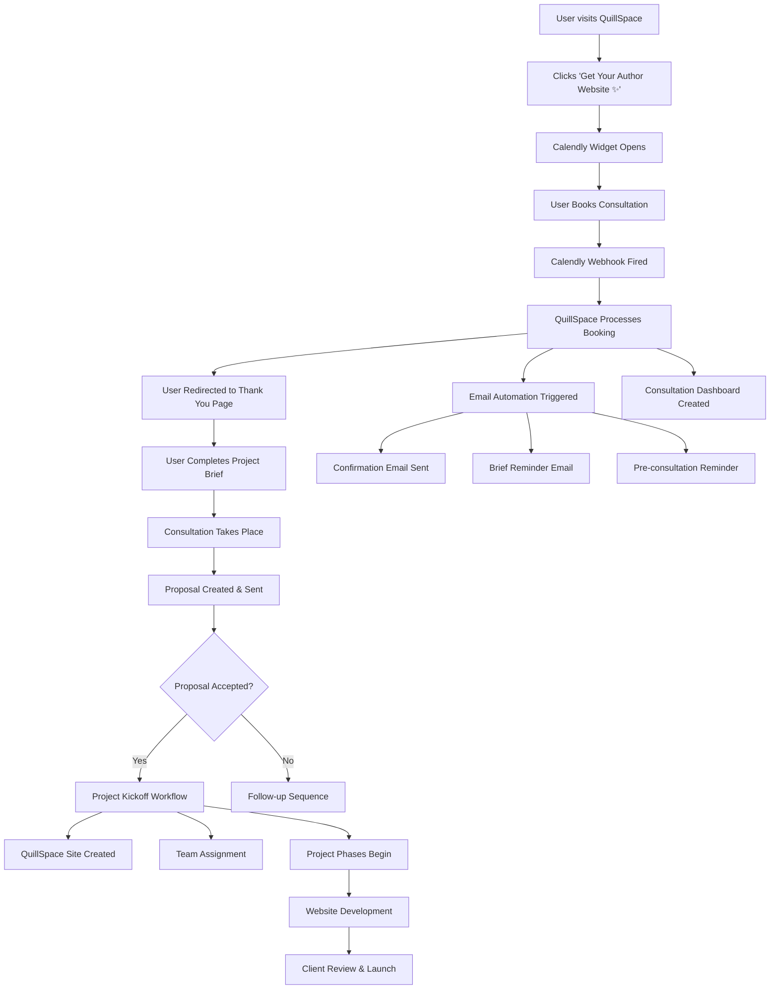

# QuillSpace Consultation System Documentation

## 🎯 Overview

The QuillSpace Consultation System is a comprehensive, automated workflow that transforms website consultation bookings into fully managed website projects. It integrates Calendly for scheduling, automated email sequences, project management, and the QuillSpace web builder platform.

## 🏗️ System Architecture



## 📋 Component Breakdown

### 1. **Calendly Integration Layer**

#### **Frontend Widget**
- **Location**: `websites/index.tsx`
- **Purpose**: Floating badge widget for booking consultations
- **Configuration**:
  ```typescript
  Calendly.initBadgeWidget({
    url: 'https://calendly.com/dev-jitpomi/30min',
    text: 'Get Your Author Website ✨',
    color: '#9caf88',
    textColor: '#ffffff',
    branding: false
  });
  ```

#### **Webhook Handler**
- **Location**: `routes/consultations.rs`
- **Endpoint**: `POST /webhooks/calendly`
- **Purpose**: Receives real-time booking events from Calendly
- **Events Handled**:
  - `invitee.created` - New booking
  - `invitee.canceled` - Booking cancellation

#### **Calendly Service**
- **Location**: `services/calendly.rs`
- **Purpose**: Processes webhook payloads and manages booking data
- **Key Functions**:
  - User matching by email
  - Booking record creation
  - Status management
  - Workflow triggering

### 2. **Database Schema**

#### **Core Tables**
```sql
-- Consultation bookings
consultation_bookings (
  id, tenant_id, user_id, calendly_event_uuid,
  event_name, scheduled_at, status, guest_email,
  project_brief, consultation_notes, proposal_sent
)

-- Project brief forms
project_brief_forms (
  booking_id, project_name, project_type, genre,
  target_audience, pages_needed, features_required,
  design_preferences, timeline, budget_range
)

-- Email automation
email_jobs (
  booking_id, email_type, recipient_email,
  template_variables, scheduled_for, status
)

-- Project management
projects (
  consultation_booking_id, project_name, client_user_id,
  assigned_designer_id, project_status, kickoff_date
)
```

### 3. **Email Automation System**

#### **Email Service**
- **Location**: `services/email_automation.rs`
- **Purpose**: Manages automated email sequences
- **Email Types**:
  - Booking confirmation (immediate)
  - Project brief reminder (2 hours later)
  - Pre-consultation reminder (24 hours before)
  - Post-consultation follow-up
  - Proposal notifications
  - Project updates

#### **Email Templates**
- **Storage**: Database-driven with variable substitution
- **Variables**: `{{event_name}}`, `{{scheduled_at}}`, `{{brief_url}}`
- **Customization**: HTML and text versions with QuillSpace branding

### 4. **User Interface Components**

#### **Thank You Page**
- **Location**: `consultation-booked/index.tsx`
- **Purpose**: Post-booking onboarding experience
- **Features**:
  - Success confirmation
  - Next steps guidance
  - Preparation checklist
  - Quick actions

#### **Consultation Dashboard**
- **Location**: `consultations/index.tsx`
- **Purpose**: Central hub for consultation management
- **Features**:
  - Upcoming consultations
  - Past consultations
  - Pending action items
  - Preparation materials

#### **Project Brief Form**
- **Location**: `consultations/[booking_id]/brief/index.tsx`
- **Purpose**: Detailed requirements gathering
- **Sections**:
  - Basic project information
  - Website requirements
  - Project details and timeline
  - Special requirements

### 5. **Project Management System**

#### **Project Kickoff Service**
- **Location**: `services/project_kickoff.rs`
- **Purpose**: Automates project initialization after proposal acceptance
- **Workflow**:
  1. Create project record
  2. Generate project phases
  3. Set up deliverables
  4. Assign team members
  5. Create QuillSpace site
  6. Schedule kickoff meeting

#### **Project Phases**
- **Discovery & Planning** (3 days)
- **Design & Wireframing** (7 days)
- **Development** (10 days)
- **Review & Launch** (5 days)

## 🔄 Complete User Journey

### **Phase 1: Discovery & Booking**

1. **User Arrives at QuillSpace**
   - Sees beautiful homepage with literary theme
   - Notices floating "Get Your Author Website ✨" badge

2. **Consultation Booking**
   - Clicks badge → Calendly widget opens
   - Selects time slot and fills basic info
   - Completes booking

3. **Immediate Response**
   - Calendly webhook fires to QuillSpace
   - User redirected to thank you page
   - Booking record created in database

### **Phase 2: Preparation**

4. **Email Sequence Begins**
   - **T+0**: Confirmation email with next steps
   - **T+2hrs**: Project brief reminder if not completed
   - **T-24hrs**: Pre-consultation reminder with checklist

5. **Project Brief Completion**
   - User accesses consultation dashboard
   - Completes comprehensive project brief
   - Requirements saved for consultation prep

6. **Consultation Preparation**
   - User reviews preparation materials
   - Team reviews project brief
   - Consultation agenda prepared

### **Phase 3: Consultation & Proposal**

7. **Consultation Meeting**
   - Discovery discussion (goals, audience, vision)
   - Design review (examples, style preferences)
   - Next steps (timeline, investment, deliverables)

8. **Proposal Creation**
   - Team creates custom proposal based on brief
   - Proposal includes scope, timeline, pricing
   - Sent via QuillSpace dashboard

9. **Decision Process**
   - Client reviews proposal in dashboard
   - Can request modifications or accept
   - Follow-up sequence if more time needed

### **Phase 4: Project Execution** (if accepted)

10. **Automated Project Kickoff**
    - Project record created in system
    - QuillSpace site initialized for client
    - Team members assigned
    - Project phases and deliverables set up

11. **Project Development**
    - **Discovery Phase**: Requirements finalization
    - **Design Phase**: Wireframes and mockups
    - **Development Phase**: Site building in QuillSpace
    - **Review Phase**: Client feedback and revisions

12. **Project Completion**
    - Final website launched
    - Training materials provided
    - Ongoing support established

## 🛠️ Technical Implementation

### **Webhook Processing Flow**

```rust
// 1. Webhook received
pub async fn handle_calendly_webhook(
    State(state): State<AppState>,
    Json(payload): Json<CalendlyWebhookPayload>,
) -> Result<StatusCode, StatusCode> {
    let calendly_service = CalendlyService::new(state.db.clone());
    calendly_service.handle_webhook(payload).await?;
    Ok(StatusCode::OK)
}

// 2. Booking processed
async fn handle_booking_created(&self, payload: CalendlyEventPayload) -> Result<()> {
    // Find user by email
    let user = self.find_user_by_email(&guest_email).await?;
    
    // Create booking record
    let booking = ConsultationBooking { /* ... */ };
    self.create_booking(booking).await?;
    
    // Trigger workflows
    self.trigger_post_booking_workflow(&event_uuid).await?;
}

// 3. Email automation triggered
pub async fn trigger_booking_sequence(&self, booking_id: Uuid) -> Result<()> {
    // Schedule confirmation email (immediate)
    self.schedule_email(booking_id, EmailType::BookingConfirmation, /* ... */).await?;
    
    // Schedule brief reminder (2 hours)
    self.schedule_email(booking_id, EmailType::ProjectBriefReminder, /* ... */).await?;
    
    // Schedule pre-consultation reminder (24 hours before)
    self.schedule_email(booking_id, EmailType::PreConsultationReminder, /* ... */).await?;
}
```

### **Database Relationships**

```sql
-- Core relationship chain
users → consultation_bookings → project_brief_forms
consultation_bookings → email_jobs
consultation_bookings → consultation_proposals → projects
projects → project_phases → project_deliverables
```

### **Security Model**

- **Row Level Security (RLS)**: Tenant isolation for all tables
- **User Access Control**: Users can only see their own bookings/projects
- **Webhook Verification**: HMAC signature validation for Calendly webhooks
- **API Authentication**: JWT tokens for all API endpoints

## 📊 Data Flow Diagrams

### **Booking Creation Flow**
```
Calendly Booking → Webhook → User Lookup → Booking Creation → Email Trigger → Dashboard Update
```

### **Email Automation Flow**
```
Trigger Event → Email Job Creation → Template Processing → Variable Substitution → Email Delivery → Status Update
```

### **Project Kickoff Flow**
```
Proposal Acceptance → Project Creation → Phase Setup → Team Assignment → Site Creation → Kickoff Scheduling
```

## 🔧 Configuration & Customization

### **Email Templates**
Templates are stored in the database and support variable substitution:

```html
<div style="font-family: Arial, sans-serif;">
    <h1>🎉 Your consultation is confirmed!</h1>
    <p>Event: {{event_name}}</p>
    <p>Date: {{scheduled_at}}</p>
    <a href="{{brief_url}}">Complete your project brief</a>
</div>
```

### **Project Phase Templates**
Project phases are automatically generated based on proposal scope:

```rust
// Customizable phase templates
phases.push(ProjectPhase {
    name: "Discovery & Planning".to_string(),
    estimated_duration_days: 3,
    deliverables: vec![
        "Project kickoff meeting".to_string(),
        "Content strategy document".to_string(),
    ],
});
```

### **Calendly Widget Customization**
Widget appearance and behavior can be customized:

```typescript
// Badge widget configuration
{
  text: 'Get Your Author Website ✨',  // Customizable text
  color: '#9caf88',                    // QuillSpace brand color
  textColor: '#ffffff',               // Text color
  branding: false                     // Hide Calendly branding
}
```

## 📈 Analytics & Monitoring

### **Key Metrics Tracked**
- Consultation booking conversion rate
- Project brief completion rate
- Email open/click rates
- Proposal acceptance rate
- Project completion timeline
- Customer satisfaction scores

### **Monitoring Points**
- Webhook delivery success/failure
- Email delivery status
- Database query performance
- API response times
- Error rates and exceptions

## 🚀 Deployment Considerations

### **Environment Requirements**
- PostgreSQL database with RLS support
- Redis for email job queuing (optional)
- HTTPS endpoint for webhook delivery
- Email service provider (SendGrid/AWS SES)

### **Scaling Considerations**
- Email job processing can be distributed
- Webhook processing should be idempotent
- Database connections should be pooled
- File uploads need object storage

### **Backup & Recovery**
- Regular database backups
- Email template versioning
- Project data archival
- Webhook event logging

## 🔍 Troubleshooting Guide

### **Common Issues**

#### **Webhook Not Receiving Events**
- Check webhook URL accessibility
- Verify SSL certificate validity
- Confirm Calendly subscription status
- Review webhook signature verification

#### **Email Delivery Problems**
- Verify email service API keys
- Check sender domain authentication
- Review email content for spam triggers
- Monitor delivery status and bounces

#### **Project Brief Not Saving**
- Check database connection
- Verify user permissions
- Review form validation errors
- Check RLS policy configuration

### **Debug Tools**
- Webhook event logging
- Email delivery tracking
- Database query monitoring
- API endpoint testing

## 📚 API Reference

### **Consultation Endpoints**
```
GET    /api/consultations              # List user consultations
GET    /api/consultations/:id          # Get consultation details
PUT    /api/consultations/:id/brief    # Update project brief
GET    /api/consultations/dashboard    # Get dashboard data
POST   /webhooks/calendly              # Calendly webhook handler
```

### **Project Management Endpoints**
```
GET    /api/projects                   # List user projects
GET    /api/projects/:id               # Get project details
GET    /api/projects/:id/dashboard     # Get project dashboard
PUT    /api/projects/:id/deliverable   # Update deliverable status
POST   /api/projects/:id/update        # Add project update
```

This system creates a seamless, professional experience that positions QuillSpace as the premium choice for author website design services, with complete automation from initial interest to project completion.
