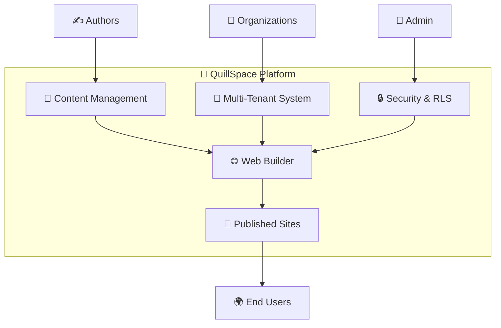
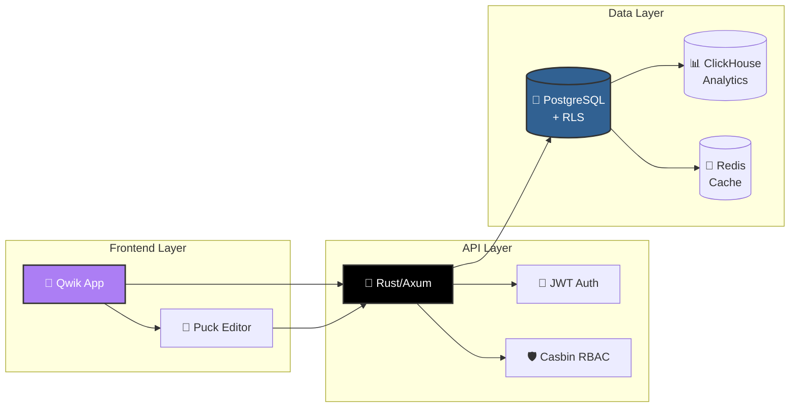
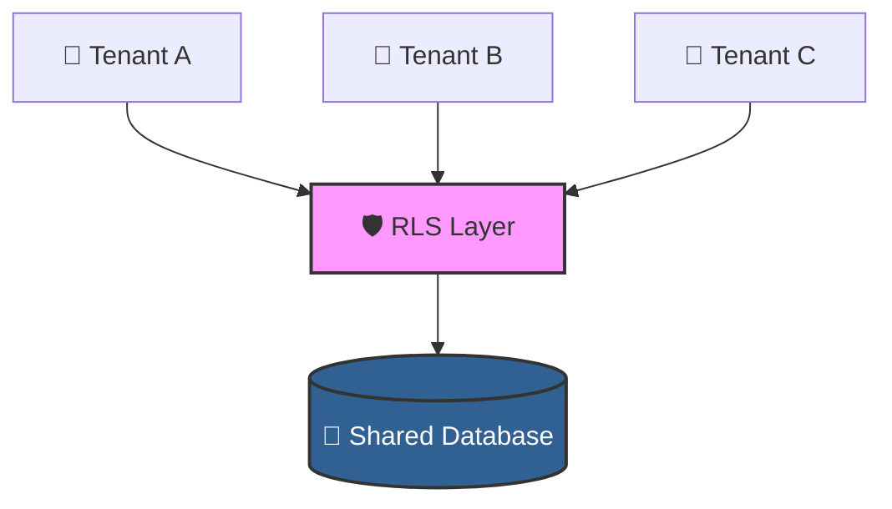
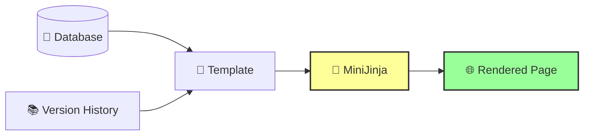
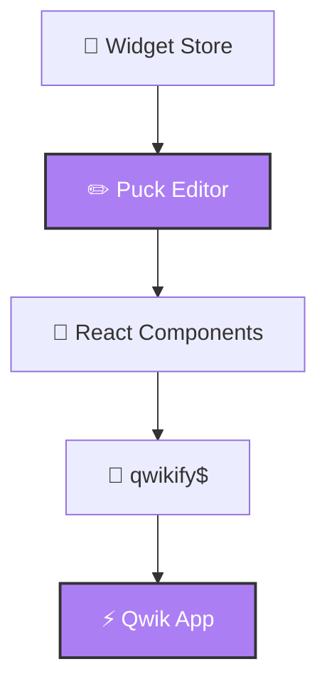
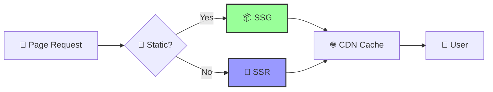
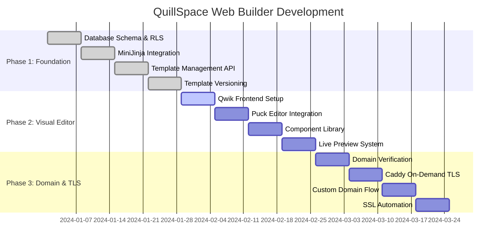

# 🚀 QuillSpace Documentation

<div align="center">


**Multi-Tenant Publishing Platform with Drag-and-Drop Web Builder**

[](https://www.rust-lang.org/)
[](https://www.postgresql.org/)
[](https://www.docker.com/)
[](https://qwik.builder.io/)

</div>

## 📖 Overview

QuillSpace is a **high-performance, multi-tenant publishing platform** with an integrated drag-and-drop web builder, designed for authors and content creators. This documentation covers the complete system architecture, from the core publishing platform to the advanced web builder capabilities.



## 📚 Documentation Structure

<table>
<tr>
<td width="33%" align="center">

### 🏗️ **Architecture**
**[Engineering Architecture](./ENGINEERING_ARCHITECTURE.md)**

Complete technical specifications, database schemas, API reference, and system design

*Perfect for: Developers, Architects*

</td>
<td width="33%" align="center">

### ⚙️ **Platform Operations**
**[Platform Guide](./PLATFORM_GUIDE.md)**

Development setup, deployment strategies, monitoring, and troubleshooting

*Perfect for: DevOps, Developers*

</td>
<td width="33%" align="center">

### 🔒 **Security**
**[Security Guide](./SECURITY_GUIDE.md)**

Complete RLS implementation, policies, testing, and best practices

*Perfect for: Security Teams, Admins*

</td>
</tr>
<tr>
<td width="33%" align="center">

### 💝 **Writers Circle**
**[Community Strategy](./WRITERS_CIRCLE_COMMUNITY.md)**

Research insights, community design, and connection features for writers

*Perfect for: Product Teams, Community Managers*

</td>
<td width="33%" align="center">

### 📊 **Analytics**
**Coming Soon**

User behavior insights, performance metrics, and growth analytics

*Perfect for: Product Teams, Analysts*

</td>
<td width="33%" align="center">

### 🎨 **Design System**
**Coming Soon**

UI components, brand guidelines, and design patterns

*Perfect for: Designers, Frontend Developers*

</td>
</tr>
</table>

## 🎯 System Overview

<div align="center">

### 🏗️ **Architecture at a Glance**



</div>

### 📊 **Current Implementation Status**

<table>
<tr>
<td width="50%">

#### ✅ **Production Ready**
- 🏢 **Multi-tenant content management**
- 🔐 **JWT authentication with Casbin RBAC**
- 🛡️ **PostgreSQL with Row-Level Security**
- 📈 **ClickHouse analytics pipeline**
- 👥 **Real user data (Yasin, Josephine)**
- 🐳 **Docker containerized deployment**

</td>
<td width="50%">

#### 🚧 **In Development**
- 🎨 **Drag-and-drop website creation**
- 🏗️ **MiniJinja template engine**
- ✏️ **Puck visual editor integration**
- ⚡ **Qwik SSR/SSG for SEO**
- 🌐 **Custom domain + automated SSL**
- 🧩 **Widget marketplace system**

</td>
</tr>
</table>

## 🛠️ Technology Stack

<div align="center">

### **Modern, High-Performance Stack**

</div>

<table>
<tr>
<td width="33%" align="center">

### 🦀 **Backend**


**Core Infrastructure**
- ⚡ Axum HTTP framework
- 🔗 tokio-postgres connection pool
- 🛡️ Casbin authorization
- 🔐 JWT authentication
- 📊 ClickHouse analytics

**Web Builder Extensions**
- 🎨 MiniJinja template engine
- 🌐 Domain verification service
- 🔒 SSL certificate automation
- 📁 Asset management (MinIO)

</td>
<td width="33%" align="center">

### 🎨 **Frontend**


**Current: API Interface**
- 🌐 Basic web interface
- 📱 Responsive design
- 🔌 REST API integration

**Future: Visual Builder**
- ⚡ Qwik City for SSR/SSG
- ✏️ Puck editor via qwikify$
- 🧩 Component marketplace
- 👁️ Real-time preview system

</td>
<td width="33%" align="center">

### 🏗️ **Infrastructure**


**Current: Docker Compose**
- 🐘 PostgreSQL (primary database)
- 📊 ClickHouse (analytics)
- 🔴 Redis (caching)
- 🐳 Docker containerization

**Future: Kubernetes**
- ☸️ Auto-scaling pods
- 📁 MinIO (object storage)
- 🌐 Caddy (reverse proxy + SSL)
- 📈 Prometheus monitoring

</td>
</tr>
</table>

## 🎯 Key Architectural Decisions

<div align="center">

### **Enterprise-Grade Design Choices**

</div>

<table>
<tr>
<td width="50%">

#### 🏢 **1. Multi-Tenancy Strategy**



- 🛡️ **Shared Schema + RLS**: Single database with row-level security
- 🔐 **Tenant Context**: Session-based tenant isolation
- 🆔 **UUID-based IDs**: Secure, non-enumerable identifiers

</td>
<td width="50%">

#### 🎨 **2. Template System**



- ⚡ **Runtime Compilation**: MiniJinja with database loader
- 📚 **Versioning**: Template history and migration support
- 🏪 **Multi-Tenant**: Per-tenant templates with public marketplace

</td>
</tr>
<tr>
<td width="50%">

#### ✏️ **3. Visual Editor**



- 🆓 **Open Source**: Puck (MIT licensed) vs proprietary Builder.io
- ⚛️ **React Integration**: qwikify$ for Qwik compatibility
- 📄 **JSON Composition**: Serializable page structure

</td>
<td width="50%">

#### ⚡ **4. SEO & Performance**



- 🔄 **Resumable Hydration**: Qwik's zero-hydration approach
- 📦 **Pre-rendering**: SSG for static pages, SSR for dynamic
- 🌐 **Edge Caching**: CDN with intelligent invalidation

</td>
</tr>
</table>

## 🗓️ Implementation Roadmap

<div align="center">

### **24-Week Development Timeline**



</div>

<table>
<tr>
<td width="33%" align="center">

### 🏗️ **Phase 1: Foundation**
**Weeks 1-4** | ✅ **Complete**

- 🗄️ Database schema with RLS policies
- 🎨 MiniJinja template engine integration
- 🔌 Basic site and page management APIs
- 📚 Template CRUD with versioning

**Status**: Production Ready ✅

</td>
<td width="33%" align="center">

### ✏️ **Phase 2: Visual Editor**
**Weeks 5-8** | 🚧 **In Progress**

- ⚡ Qwik frontend setup with Puck integration
- 🧩 Component library and widget system
- 👁️ Live preview and editing interface
- 🎨 Template selection and customization

**Status**: 60% Complete 🚧

</td>
<td width="33%" align="center">

### 🌐 **Phase 3: Domain & TLS**
**Weeks 9-12** | ⏳ **Planned**

- 🔍 Domain verification service
- 🔒 Caddy On-Demand TLS setup
- 🌐 Custom domain onboarding flow
- 📜 SSL certificate automation

**Status**: Planning Phase ⏳

</td>
</tr>
</table>
## 🚀 Quick Start

<div align="center">

### **Get QuillSpace Running in 5 Minutes**

</div>

<table>
<tr>
<td width="33%" align="center">

### 1️⃣ **Clone & Setup**
```bash
git clone <repo-url>
cd quillspace
cp .env.example .env
# Edit `.env` with your settings
