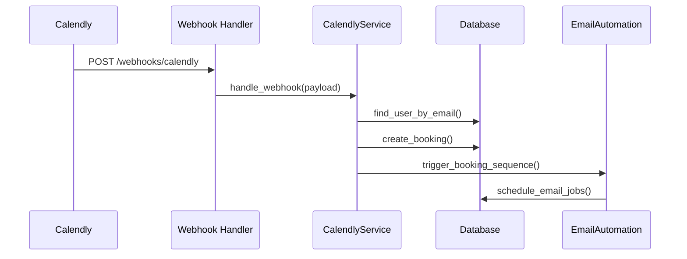
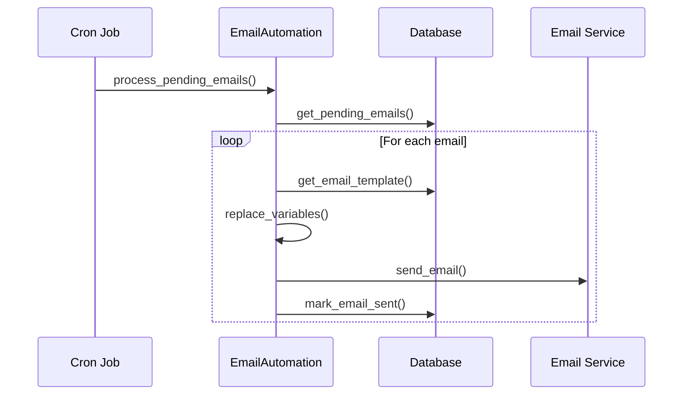

# QuillSpace Consultation System - Technical Architecture

## 🏗️ System Overview

The QuillSpace Consultation System is built as a microservice-oriented architecture that integrates with external services (Calendly) while maintaining data sovereignty and providing a seamless user experience.

## 📐 Architecture Principles

### **1. Event-Driven Architecture**
- Webhooks trigger automated workflows
- Asynchronous email processing
- Decoupled service communication
- Event sourcing for audit trails

### **2. Multi-Tenant Security**
- Row-Level Security (RLS) at database level
- Tenant isolation for all operations
- User-based access controls
- API authentication via JWT

### **3. Scalable Design**
- Horizontal scaling capabilities
- Queue-based email processing
- Database connection pooling
- Stateless service design

## 🔧 Technology Stack

### **Backend (Rust)**
```rust
// Core dependencies
tokio-postgres = "0.7"     // Async PostgreSQL driver
axum = "0.7"              // Web framework
serde = "1.0"             // Serialization
uuid = "1.0"              // UUID generation
chrono = "0.4"            // Date/time handling
anyhow = "1.0"            // Error handling
```

### **Frontend (Qwik + TypeScript)**
```typescript
// Core dependencies
@builder.io/qwik          // Resumable framework
@qwikest/icons/lucide     // Icon library
// Calendly widget integration via CDN
```

### **Database (PostgreSQL)**
- Row-Level Security (RLS) enabled
- JSONB for flexible data storage
- Enum types for status management
- Trigger-based timestamp updates

### **External Integrations**
- **Calendly API**: Booking management and webhooks
- **Email Services**: SendGrid, AWS SES, or Mailgun
- **File Storage**: MinIO or AWS S3 (for assets)

## 🗂️ Service Architecture

### **1. Core Services**

#### **CalendlyService**
```rust
pub struct CalendlyService {
    db: Database,
}

impl CalendlyService {
    // Webhook processing
    pub async fn handle_webhook(&self, payload: CalendlyWebhookPayload) -> Result<()>
    
    // Booking management
    pub async fn create_booking(&self, booking: ConsultationBooking) -> Result<()>
    pub async fn update_booking_status(&self, uuid: &str, status: BookingStatus) -> Result<()>
    
    // User operations
    pub async fn get_user_bookings(&self, user_id: Uuid) -> Result<Vec<ConsultationBooking>>
}
```

#### **EmailAutomationService**
```rust
pub struct EmailAutomationService {
    db: Database,
}

impl EmailAutomationService {
    // Sequence management
    pub async fn trigger_booking_sequence(&self, booking_id: Uuid) -> Result<()>
    
    // Email processing
    pub async fn process_pending_emails(&self) -> Result<()>
    pub async fn send_email(&self, job: &EmailJob) -> Result<()>
    
    // Template management
    pub async fn get_email_template(&self, email_type: &EmailType) -> Result<EmailTemplate>
}
```

#### **ProjectKickoffService**
```rust
pub struct ProjectKickoffService {
    db: Database,
}

impl ProjectKickoffService {
    // Project initialization
    pub async fn initialize_project(&self, proposal_id: Uuid) -> Result<ProjectKickoff>
    
    // Workflow management
    pub async fn trigger_kickoff_workflow(&self, project: &ProjectKickoff) -> Result<()>
    
    // Dashboard operations
    pub async fn get_project_dashboard(&self, project_id: Uuid) -> Result<ProjectDashboard>
}
```

### **2. API Layer**

#### **Route Structure**
```rust
// Consultation routes
Router::new()
    .route("/webhooks/calendly", post(handle_calendly_webhook))
    .route("/consultations", get(get_user_consultations))
    .route("/consultations/:booking_id", get(get_consultation_details))
    .route("/consultations/:booking_id/brief", put(update_project_brief))
    .route("/consultations/dashboard", get(get_consultation_dashboard))

// Project routes  
Router::new()
    .route("/projects", get(get_user_projects))
    .route("/projects/:project_id", get(get_project_details))
    .route("/projects/:project_id/dashboard", get(get_project_dashboard))
```

#### **Middleware Stack**
```rust
// Authentication middleware
pub struct AuthContext {
    pub user_id: Uuid,
    pub tenant_id: Uuid,
    pub user_role: String,
}

// Database session setup
async fn setup_db_session(auth: &AuthContext, db: &Database) -> Result<()> {
    db.execute("SET app.current_user_id = $1", &[&auth.user_id]).await?;
    db.execute("SET app.current_tenant_id = $1", &[&auth.tenant_id]).await?;
    db.execute("SET app.user_role = $1", &[&auth.user_role]).await?;
    Ok(())
}
```

## 🗄️ Database Design

### **Schema Architecture**

#### **Core Entity Relationships**
```sql
-- Primary entities
users (id, tenant_id, email, ...)
tenants (id, name, ...)

-- Consultation workflow
consultation_bookings (id, tenant_id, user_id, calendly_event_uuid, ...)
project_brief_forms (booking_id, project_name, genre, ...)
consultation_proposals (booking_id, title, scope_of_work, ...)

-- Email automation
email_jobs (id, booking_id, email_type, scheduled_for, ...)
email_templates (id, email_type, subject, html_content, ...)

-- Project management
projects (id, consultation_booking_id, project_name, ...)
project_phases (id, project_id, name, estimated_duration_days, ...)
project_deliverables (id, project_id, name, due_date, status, ...)
```

#### **Row-Level Security Implementation**
```sql
-- Tenant isolation policy
CREATE POLICY consultation_bookings_tenant_isolation ON consultation_bookings
    FOR ALL USING (tenant_id = current_setting('app.current_tenant_id')::UUID);

-- User access policy
CREATE POLICY consultation_bookings_user_access ON consultation_bookings
    FOR ALL USING (
        user_id = current_setting('app.current_user_id')::UUID 
        OR current_setting('app.user_role') = 'admin'
    );
```

### **Data Flow Patterns**

#### **Booking Creation Flow**


#### **Email Processing Flow**


## 🔐 Security Architecture

### **Authentication & Authorization**

#### **JWT Token Structure**
```json
{
  "sub": "user_uuid",
  "tenant_id": "tenant_uuid", 
  "role": "user|admin",
  "exp": 1640995200,
  "iat": 1640908800
}
```

#### **Permission Matrix**
| Resource | User | Admin | External |
|----------|------|-------|----------|
| Own Bookings | Read/Write | Read/Write | None |
| Other Bookings | None | Read/Write | None |
| Email Templates | None | Read/Write | None |
| Webhook Endpoints | None | None | Write |

### **Data Protection**

#### **Webhook Security**
```rust
pub fn verify_webhook_signature(
    payload: &str,
    signature: &str,
    secret: &str,
) -> Result<bool, Box<dyn std::error::Error>> {
    use hmac::{Hmac, Mac};
    use sha2::Sha256;
    
    type HmacSha256 = Hmac<Sha256>;
    
    let mut mac = HmacSha256::new_from_slice(secret.as_bytes())?;
    mac.update(payload.as_bytes());
    
    let expected = format!("sha256={}", hex::encode(mac.finalize().into_bytes()));
    Ok(expected == signature)
}
```

#### **Input Validation**
```rust
#[derive(Debug, Deserialize, Validate)]
pub struct ProjectBriefRequest {
    #[validate(length(min = 1, max = 100))]
    pub project_name: Option<String>,
    
    #[validate(email)]
    pub contact_email: String,
    
    #[validate(range(min = 1000, max = 100000))]
    pub budget_range: Option<i32>,
}
```

## 🚀 Performance Considerations

### **Database Optimization**

#### **Indexing Strategy**
```sql
-- Performance indexes
CREATE INDEX idx_consultation_bookings_user_scheduled 
    ON consultation_bookings(user_id, scheduled_at);

CREATE INDEX idx_email_jobs_status_scheduled 
    ON email_jobs(status, scheduled_for) 
    WHERE status = 'pending';

CREATE INDEX idx_projects_status_completion 
    ON projects(project_status, estimated_completion);
```

#### **Query Optimization**
```rust
// Efficient user booking query with pagination
pub async fn get_user_bookings_paginated(
    &self, 
    user_id: Uuid, 
    limit: i64, 
    offset: i64
) -> Result<Vec<ConsultationBooking>> {
    let query = "
        SELECT * FROM consultation_bookings 
        WHERE user_id = $1 
        ORDER BY scheduled_at DESC 
        LIMIT $2 OFFSET $3
    ";
    // Implementation...
}
```

### **Caching Strategy**

#### **Email Template Caching**
```rust
use std::collections::HashMap;
use tokio::sync::RwLock;

pub struct TemplateCache {
    cache: RwLock<HashMap<EmailType, EmailTemplate>>,
    ttl: Duration,
}

impl TemplateCache {
    pub async fn get_template(&self, email_type: &EmailType) -> Option<EmailTemplate> {
        let cache = self.cache.read().await;
        cache.get(email_type).cloned()
    }
}
```

### **Async Processing**

#### **Email Queue Processing**
```rust
// Background email processing
pub async fn start_email_processor(service: EmailAutomationService) {
    let mut interval = tokio::time::interval(Duration::from_secs(60));
    
    loop {
        interval.tick().await;
        
        if let Err(e) = service.process_pending_emails().await {
            tracing::error!("Email processing error: {}", e);
        }
    }
}
```

## 📊 Monitoring & Observability

### **Logging Strategy**
```rust
// Structured logging with tracing
#[tracing::instrument(skip(self))]
pub async fn handle_webhook(&self, payload: CalendlyWebhookPayload) -> Result<()> {
    tracing::info!(
        event_type = %payload.event,
        event_uuid = %payload.payload.scheduled_event.uuid,
        "Processing Calendly webhook"
    );
    
    // Processing logic...
    
    tracing::info!("Webhook processed successfully");
    Ok(())
}
```

### **Metrics Collection**
```rust
// Custom metrics
use prometheus::{Counter, Histogram, register_counter, register_histogram};

lazy_static! {
    static ref WEBHOOK_COUNTER: Counter = register_counter!(
        "calendly_webhooks_total", 
        "Total number of Calendly webhooks processed"
    ).unwrap();
    
    static ref EMAIL_DURATION: Histogram = register_histogram!(
        "email_processing_duration_seconds",
        "Time spent processing emails"
    ).unwrap();
}
```

### **Health Checks**
```rust
// Health check endpoint
pub async fn health_check(State(state): State<AppState>) -> Json<HealthStatus> {
    let db_healthy = state.db.execute("SELECT 1", &[]).await.is_ok();
    let email_queue_size = get_pending_email_count(&state.db).await.unwrap_or(0);
    
    Json(HealthStatus {
        database: if db_healthy { "healthy" } else { "unhealthy" },
        email_queue_size,
        timestamp: Utc::now(),
    })
}
```

## 🔄 Deployment Architecture

### **Container Strategy**
```dockerfile
# Multi-stage build for Rust backend
FROM rust:1.70 as builder
WORKDIR /app
COPY . .
RUN cargo build --release

FROM debian:bookworm-slim
RUN apt-get update && apt-get install -y ca-certificates
COPY --from=builder /app/target/release/quillspace-core /usr/local/bin/
EXPOSE 8080
CMD ["quillspace-core"]
```

### **Environment Configuration**
```yaml
# docker-compose.yml
version: '3.8'
services:
  api:
    build: .
    environment:
      - DATABASE_URL=${DATABASE_URL}
      - CALENDLY_API_TOKEN=${CALENDLY_API_TOKEN}
      - CALENDLY_WEBHOOK_SECRET=${CALENDLY_WEBHOOK_SECRET}
    depends_on:
      - postgres
      
  postgres:
    image: postgres:15
    environment:
      - POSTGRES_DB=quillspace
      - POSTGRES_USER=${DB_USER}
      - POSTGRES_PASSWORD=${DB_PASSWORD}
    volumes:
      - postgres_data:/var/lib/postgresql/data
```

### **Scaling Considerations**

#### **Horizontal Scaling**
- Stateless API servers behind load balancer
- Database connection pooling
- Shared Redis for session storage
- Queue-based email processing

#### **Database Scaling**
- Read replicas for reporting queries
- Connection pooling with pgbouncer
- Partitioning for large tables
- Regular maintenance and optimization

## 🧪 Testing Strategy

### **Unit Tests**
```rust
#[cfg(test)]
mod tests {
    use super::*;
    
    #[tokio::test]
    async fn test_booking_creation() {
        let service = CalendlyService::new(mock_db());
        let payload = mock_webhook_payload();
        
        let result = service.handle_webhook(payload).await;
        assert!(result.is_ok());
    }
}
```

### **Integration Tests**
```rust
#[tokio::test]
async fn test_email_automation_flow() {
    let db = setup_test_db().await;
    let service = EmailAutomationService::new(db);
    
    // Create test booking
    let booking_id = create_test_booking(&service).await;
    
    // Trigger email sequence
    service.trigger_booking_sequence(booking_id).await.unwrap();
    
    // Verify emails were scheduled
    let pending_emails = get_pending_emails(&service, booking_id).await;
    assert_eq!(pending_emails.len(), 3);
}
```

This technical architecture provides a robust, scalable foundation for the QuillSpace consultation system while maintaining security, performance, and maintainability.
