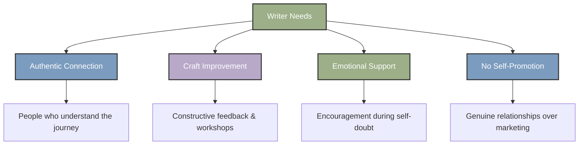
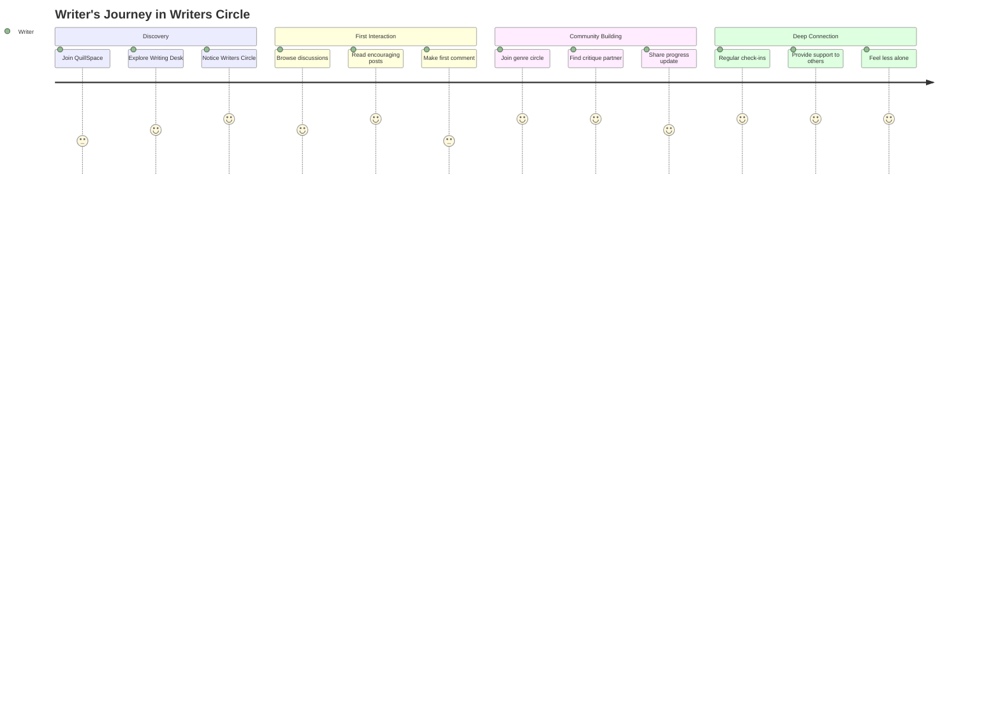

# 💝 Writers Circle: Community & Connection Strategy

<div align="center">


**"Feel less alone on the way there"**

*Addressing the core need of writers for authentic connection and community*

</div>

## 🎯 Overview

The **Writers Circle** is QuillSpace's answer to the fundamental challenge every writer faces: **loneliness and isolation**. Based on comprehensive research into writing communities and writer needs, this feature transforms QuillSpace from a writing tool into a true sanctuary where writers can find both creative space and meaningful connection.

## 📊 Research Insights: What Writers Need Most

### 🔍 **Primary Research Findings**

Based on analysis of major writing communities (Scribophile, Critique Circle, Absolute Write, She Writes, etc.), writers consistently seek:

<table>
<tr>
<td width="50%">

#### 💔 **Core Pain Points**
- **Loneliness is the #1 struggle** writers face
- Writing is inherently solitary work
- Days pass without meaningful human connection
- Self-doubt and insecurity plague the creative process
- Lack of understanding from non-writers

</td>
<td width="50%">

#### 💝 **Core Desires**
- **Emotional support** from people who "get it"
- **Understanding** of the creative process and struggles
- **Encouragement** during difficult writing phases
- **Constructive feedback** without harsh criticism
- **Accountability** and motivation to keep writing

</td>
</tr>
</table>

### 🎭 **Writer Community Preferences**



## 🏛️ Writers Circle Architecture

### 🧭 **Navigation Integration**

The Writers Circle replaces "My Writing" in the main navigation, creating a clear distinction:

```
📍 Navigation Structure:
├── 🏠 Writing Desk (main workspace)
├── 💝 Writers Circle (community connection) ← NEW
├── 🌐 My Website (author platform)
├── 👥 Readers (audience analytics)
└── ⚙️ Settings
```

### 🎨 **Brand Alignment**

The Writers Circle perfectly embodies QuillSpace's core promise:

> **"A quiet place to build your book, share your voice, and feel less alone on the way there."**

- **"Writers Circle"** evokes intimate, supportive gatherings
- **Heart icon (LuHeart)** represents connection and care
- **Literary language** maintains the sanctuary atmosphere
- **No self-promotion** keeps focus on authentic support

## 🌟 Feature Design Philosophy

### 🤝 **Community Values**

<table>
<tr>
<td width="33%" align="center">

#### 🕊️ **Quiet Connection**
*Not a noisy social network*

- Thoughtful, contemplative interaction
- Quality over quantity engagement
- Respectful, literary discourse
- Sanctuary atmosphere maintained

</td>
<td width="33%" align="center">

#### 💎 **Authentic Support**
*Genuine relationships*

- No self-promotion allowed
- Focus on craft and encouragement
- Mutual aid and understanding
- Long-term relationship building

</td>
<td width="33%" align="center">

#### 📚 **Craft-Focused**
*Writing comes first*

- Genre-specific discussions
- Technique and process sharing
- Constructive feedback culture
- Industry knowledge exchange

</td>
</tr>
</table>

### 🎯 **Target User Personas**

#### 👤 **The Isolated Novelist**
- **Pain**: Writes alone for months, doubts their work
- **Need**: Encouragement and feedback from fellow writers
- **Benefit**: Regular check-ins and critique partners

#### 👤 **The Insecure Beginner**
- **Pain**: Overwhelmed by the writing process, imposter syndrome
- **Need**: Gentle guidance and reassurance they're not alone
- **Benefit**: Beginner-friendly groups and mentorship

#### 👤 **The Genre Specialist**
- **Pain**: Friends/family don't understand their specific genre
- **Need**: Connect with writers in same genre for specialized advice
- **Benefit**: Genre-specific circles and expert knowledge

## 🏗️ Implementation Strategy

### 📱 **Core Features**

<table>
<tr>
<td width="50%">

#### 🎪 **Circle Structure**
- **Main Writers Circle**: General community
- **Genre Circles**: Sci-fi, Romance, Mystery, etc.
- **Stage Circles**: Beginners, Published Authors, etc.
- **Purpose Circles**: Critique Partners, Accountability, etc.

#### 💬 **Interaction Types**
- **Discussions**: Craft questions, industry insights
- **Check-ins**: Progress updates, encouragement
- **Critique Exchange**: Structured feedback system
- **Writing Prompts**: Community challenges

</td>
<td width="50%">

#### 🛡️ **Community Guidelines**
- **No self-promotion** (strictly enforced)
- **Constructive feedback only** (no harsh criticism)
- **Respect for all writing stages** (beginners welcome)
- **Genre diversity celebrated** (no literary snobbery)

#### 🎨 **QuillSpace Integration**
- **Writing progress sharing** (optional)
- **Milestone celebrations** (book completions, etc.)
- **Resource sharing** (craft articles, opportunities)
- **Quiet accountability** (gentle progress tracking)

</td>
</tr>
</table>

### 🔄 **User Journey**



## 🎪 **Circle Types & Structure**

### 🌍 **Main Circles**

<table>
<tr>
<td width="25%" align="center">

#### 🌟 **Welcome Circle**
*New member orientation*

- Platform introduction
- Community guidelines
- First connections
- Beginner resources

</td>
<td width="25%" align="center">

#### ✍️ **Craft Circle**
*Writing technique & process*

- Plot development
- Character creation
- Writing routines
- Productivity tips

</td>
<td width="25%" align="center">

#### 💪 **Support Circle**
*Encouragement & motivation*

- Progress celebrations
- Overcoming blocks
- Dealing with rejection
- Mental health support

</td>
<td width="25%" align="center">

#### 📚 **Industry Circle**
*Publishing & business*

- Query letters
- Agent hunting
- Self-publishing
- Marketing (craft-focused)

</td>
</tr>
</table>

### 🎭 **Genre Circles**

Specialized communities for specific writing genres:

- 🚀 **Science Fiction & Fantasy**
- 💕 **Romance Writers**
- 🔍 **Mystery & Thriller**
- 📖 **Literary Fiction**
- 📚 **Non-Fiction Authors**
- 🧒 **Children's & YA**
- ✍️ **Poetry & Short Stories**

### 🎯 **Purpose Circles**

Task-oriented communities:

- 🔄 **Critique Partners**
- 📅 **Accountability Groups**
- 🏃 **Writing Sprints**
- 📝 **Beta Readers**
- 🎓 **Mentorship Program**

## 🎨 **UI/UX Design Principles**

### 🕊️ **Sanctuary Aesthetic**

```css
/* Writers Circle Design Language */
.writers-circle {
  /* Warm, literary colors */
  --primary: #9CAF88;    /* Sage green - growth, peace */
  --secondary: #7C9CBF;  /* Soft blue - trust, calm */
  --accent: #B8A9C9;     /* Lavender - creativity, wisdom */
  --text: #2D3748;       /* Charcoal - readability, warmth */
  
  /* Typography */
  font-family: 'Crimson Text', serif; /* Literary feel */
  line-height: 1.6; /* Comfortable reading */
  
  /* Spacing */
  padding: 2rem; /* Generous whitespace */
  border-radius: 12px; /* Soft, welcoming edges */
}
```

### 💝 **Interaction Design**

- **Gentle animations** (no jarring movements)
- **Soft color transitions** (peaceful state changes)
- **Generous whitespace** (room to breathe)
- **Clear typography hierarchy** (easy scanning)
- **Heart-based iconography** (connection theme)

## 📈 **Success Metrics**

### 🎯 **Community Health Indicators**

<table>
<tr>
<td width="50%">

#### 📊 **Engagement Metrics**
- **Daily active discussions** (quality over quantity)
- **Response time to new posts** (community responsiveness)
- **Member retention rate** (long-term relationships)
- **Cross-circle participation** (diverse engagement)

</td>
<td width="50%">

#### 💝 **Connection Metrics**
- **Critique partnerships formed** (meaningful connections)
- **Support thread participation** (mutual aid)
- **Milestone celebrations** (community joy)
- **Member-generated content** (organic growth)

</td>
</tr>
</table>

### 🌱 **Growth Strategy**

1. **Seed Community**: Invite established writers as community leaders
2. **Genre Champions**: Recruit genre experts to lead specialized circles
3. **Organic Growth**: Word-of-mouth from satisfied members
4. **Quality Control**: Maintain high standards for discourse
5. **Continuous Improvement**: Regular member feedback and iteration

## 🔮 **Future Enhancements**

### 🎪 **Advanced Features**

- **Virtual Writing Retreats**: Scheduled quiet writing sessions
- **Mentor Matching**: Experienced writers paired with beginners
- **Reading Groups**: Book clubs focused on craft analysis
- **Guest Expert Sessions**: Industry professionals sharing insights
- **Writing Challenges**: Community-wide creative exercises

### 🌐 **Integration Opportunities**

- **Progress Sharing**: Optional writing stats from Writing Desk
- **Milestone Notifications**: Automatic celebration of achievements
- **Resource Library**: Community-curated craft resources
- **Event Calendar**: Writing workshops and community gatherings

## 🎯 **Implementation Roadmap**

### 📅 **Phase 1: Foundation (Weeks 1-4)**
- Basic circle structure and navigation
- Core discussion functionality
- Community guidelines and moderation
- Welcome Circle setup

### 📅 **Phase 2: Specialization (Weeks 5-8)**
- Genre-specific circles
- Critique partner matching
- Advanced discussion features
- Mobile optimization

### 📅 **Phase 3: Enhancement (Weeks 9-12)**
- Mentorship program
- Writing challenges
- Integration with Writing Desk
- Analytics and insights

---

<div align="center">

### 💝 **"Where words find warmth, and stories find their voice"**

*The Writers Circle transforms QuillSpace from a writing tool into a true sanctuary—a place where writers can create, connect, and feel less alone on their journey.*

</div>
